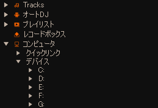
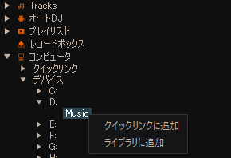
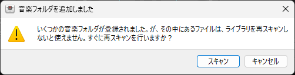
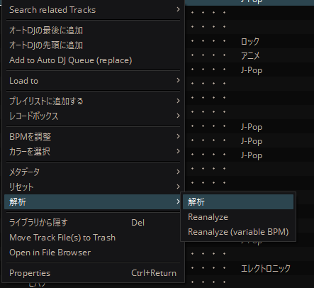

# mixxx-memo

## ライブラリに曲を追加

Mixxxでは、`コンピュータ`>`デバイス`からUSB等の曲を直接読み込むことができるが、BPM解析等は直接読み込みでは使えない

しかし、あらかじめMixxxに楽曲の保存先を指定しておくことで、BPM解析などができるようになる

楽曲の入っているフォルダを右クリックして`ライブラリに追加`を選択することでライブラリに曲を追加することができる

再スキャンを促すメッセージが表示されるので、`スキャン`を選択

スキャンが終わると、`Tracks`に曲が読み込まれている

## BPM解析
曲を選択(複数選択可)して右クリック`解析`>`解析`で楽曲のBPMを解析してくれる

### 可変BPM解析
もし、曲中でBPMが変化するものがあれば、可変BPMとして解析することもできる

可変BPMとして解析するには、`解析`>`Reanalyze (variable BPM)`を選択することで可能
